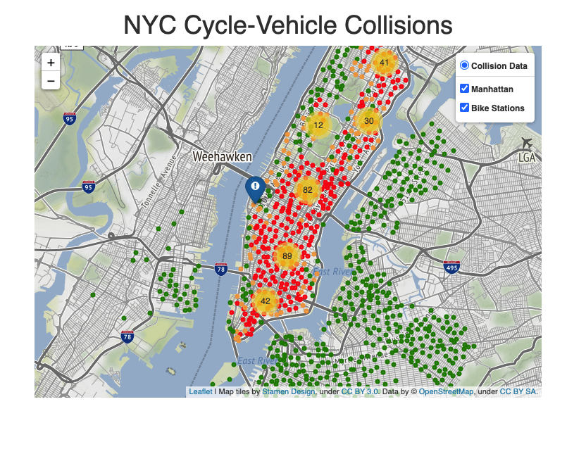

# CreditShelf Exercise
### Prerequsites
- Mac/Linux OS
- [Conda](https://docs.conda.io/en/latest/miniconda.html) environment manager
- `unzip` CLI utility (`apt-get install unzip` or `brew install unzip`)

### Setting up the virtual environment
Create the environment:  
`conda env create -f environment.yml`  

Activate the environment:  
`conda activate creditshelf-gjohnson`

### Download S3 Data
Now that the virtual environment has been created, the next
step is to download the 2019 bike station data from the [S3 bucket](https://s3.amazonaws.com/tripdata/index.html).
Run the following command to download and unzip the data:  
`./get_s3_data.sh`

### Build External DB and Process Bike Station Data
Next, run the following Python script to build the external
SQLite database and populate it with bike station data:   
`python get_station_data.py`

### Download and Process Collision Data
Now that the external database has been built and populated with
bike station data, the next step is to download and process the cycle/vehicle
collision data. The reason we do this after processing the bike station
data is for the performance gains when calculating the distance from bike stations
to collision locations.
   
For this step you will need an API key to read from the [NYC Data API](https://dev.socrata.com/foundry/data.cityofnewyork.us/h9gi-nx95).
Also, you will need to specify which NYC borough to get data from. Note the quotes
around the arguments in the following command:  
`python get_collision_data.py "manhattan" "secret-api-key"`

### Start the Web App
`flask run`  

The web app can be viewed at `http://localhost:5000`. You should see something like the
screenshot below:

  
Note the legend in the top right corner. The circular dots are the bike stations and the 
other markers are the collisions. Try zooming in to get a better view. The bike stations
are color coded using an interquartile range to represent how many collisions occurred within 200m of the station.   